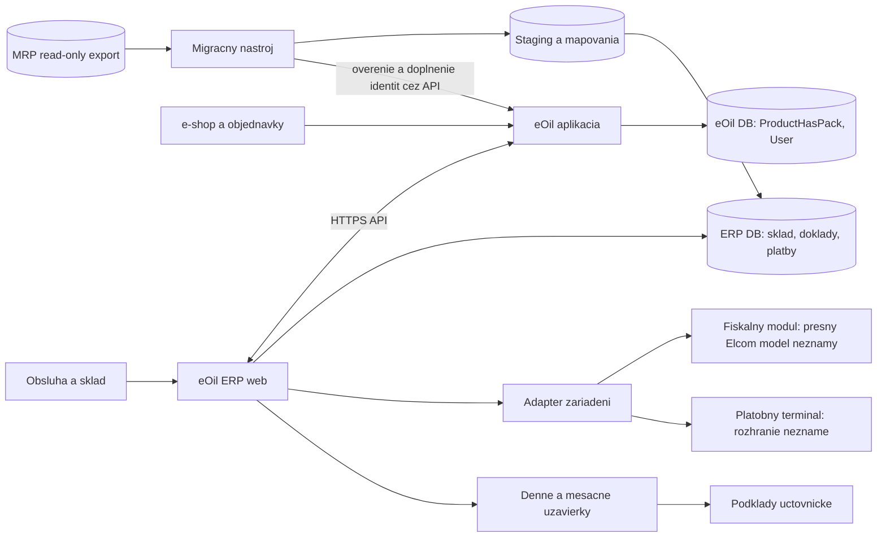
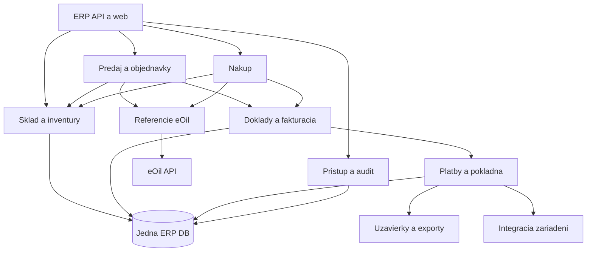

# Návrh architektúry a vlastníctva dát

**Stav: návrh na ďalšie overenie.** Autorita ProductHasPack a User v eOil je potvrdená používateľom. Ostatné hranice nižšie sú odporúčania alebo otvorené rozhodnutia. Nejde ešte o schválený implementačný kontrakt.

Odporúčanie: **samostatná modulárna PHP aplikácia s jednou vlastnou relačnou databázou**, vlastným nasadením a API. Sklad, doklady, platby a pokladňa sú moduly jedného systému; majú spoločné transakcie tam, kde je to možné. Fiškálne zariadenie a terminál sú externé systémy s vlastným výsledkom operácie.

Adapter zariadení je logická hranica. Môže byť knižnica alebo malá lokálna služba pri zariadení; samostatný proces, operačný systém a protokol sa vyberú až po overení modelu/SDK. Diagram nepredpokladá, že Elcom má HTTP API alebo podporuje macOS.

## Autorita po entitách

| Údaj | Autorita | Lokálne v ERP | Stav |
|---|---|---|---|
| Product, Pack, ProductHasPack | eOil | Stabilné ID + minimálna verzovaná projekcia pre vyhľadávanie a doklady | ProductHasPack potvrdené; detaily kontraktu otvorené |
| User | eOil | Referencia, oprávnenia ERP; snímka autora na audite | Potvrdené |
| Prihlásenie | eOil alebo spoločný identity provider | Vlastná session ERP, žiadna kópia hesiel | Návrh; eOil dnes nemá overené všeobecné SSO |
| Odberateľ/právnická osoba | eOil, s doplnením existujúceho modelu ak treba | PartnerRef a nemenná snímka na doklade | Návrh; väzba User–Customer sa musí upresniť |
| Dodávateľ | Preferovane existujúci eOil Supplier | Referencia a snímka | Rozhodnúť presný rozsah „a pod.“ |
| MRP historická identita | Migračná mapa v ERP; existujúci ExternalId v eOil | SourceKey → eOil ID / ERP ID, história rozhodnutí | Návrh; typ 14 zachovať pri prechode |
| Sklad, pohyb, rezervácia, inventúra, ocenenie | ERP | Plná evidencia a denník | Návrh cieľa náhrady |
| Dostupnosť pre e-shop | ERP výpočet; eOil projekcia | Skladový stav a pravidlá dostupnosti | Návrh; dodávateľská dostupnosť v eOil ostáva osobitný údaj |
| E-shop objednávka | eOil ako zdroj požiadavky zákazníka | Referencia orderId, verzia, fulfillment a väzby | Odporúčanie; autoritu editácií po prijatí musí potvrdiť workflow |
| Ponuka, nákupná objednávka | ERP | Vlastné pracovné doklady | Návrh podľa MRP dát |
| Faktúra, opravný doklad, úhrada, pokladňa | ERP | Vlastné životné cykly, číselné rady, audit | Návrh podľa rozsahu náhrady |
| Predajná cena, zľavy, DPH pravidlá | Zatiaľ nerozhodnuté | Cena a daň na vystavenom doklade vždy ako snímka | Otvorené; nesmú vzniknúť dva nezávislé editory cenníka |
| Fiškálny výsledok | Fiškálne zariadenie/služba | Doložený výsledok, ID, stav overenia a väzby | Potrebné potvrdiť protokol |
| Terminálová transakcia | Poskytovateľ terminálu | Referencia, potvrdený stav, párovanie platby | Potrebné potvrdiť zariadenie/protokol |

Historická snímka údajov na faktúre nie je druhý kmeňový register. Zmena mena či balenia v eOil nesmie spätne meniť už vydaný doklad. ERP však nesmie samostatne zakladať nové obchodné SKU bez kanonického ProductHasPack ID z eOil.

## Moduly a transakcie

Skladový pohyb, lokálne väzby dokladov, audit a dokončenie ERP operácie sa ukladajú v jednej DB transakcii. Externé volanie zariadenia ani eOil API sa nedrží pod dlhým DB zámkom. Medzi eOil a ERP nie je distribuovaná transakcia: príkazy majú identitu a opakovateľný výsledok.

## Technológia

Používateľ 27. 9. 2026 zvolil **Yii3** a rovnaký CSS/JS template ako newadmin. Prvý balík používa PHP 8.4 v Dockeri, Yii3 web template a server-rendered views s Limitless v4/Bootstrap 5/Phosphor. Podrobnosti a overené zdroje sú v [ADR-004](../decisions/004-yii3-and-newadmin-theme.md).

Vývoj pokračuje po funkčných balíkoch; úplná analýza všetkých agend nie je predpokladom spustenia lokálneho základu. Neoverené pravidlá ocenenia a fiškalizácie však zostávajú podmienkou ich vlastnej implementácie. Prvý balík nepotrebuje ERP databázu; jej voľba a skladové transakcie prídu spolu so skladovým modulom. Broker, Kubernetes ani SPA nie sú súčasťou základu.

## Dostupnosť a bezpečnosť

- Kanonické ID nikdy nerecyklovať; deaktivácia produktu má iný význam než strata historickej referencie.
- ERP si môže držať minimálnu cache kmeňových údajov. Vek cache a režim pri výpadku eOil musia byť viditeľné; zakladanie identity počas výpadku sa odloží.
- Nové API potrebuje samostatné servisné identity, obmedzené scopes a audit používateľa, v mene ktorého sa koná. Nekopírovať token existujúceho špecializovaného API.
- Neposielať heslá User ani nepotrebné osobné údaje. Údaje na dokladoch podliehajú vlastnej retenčnej politike.
- Pred prechodom musí byť otestovaná obnova ERP databázy aj príloh, autorizácia opráv a uzávierok a oddelenie testovacích zariadení od reálnych.
