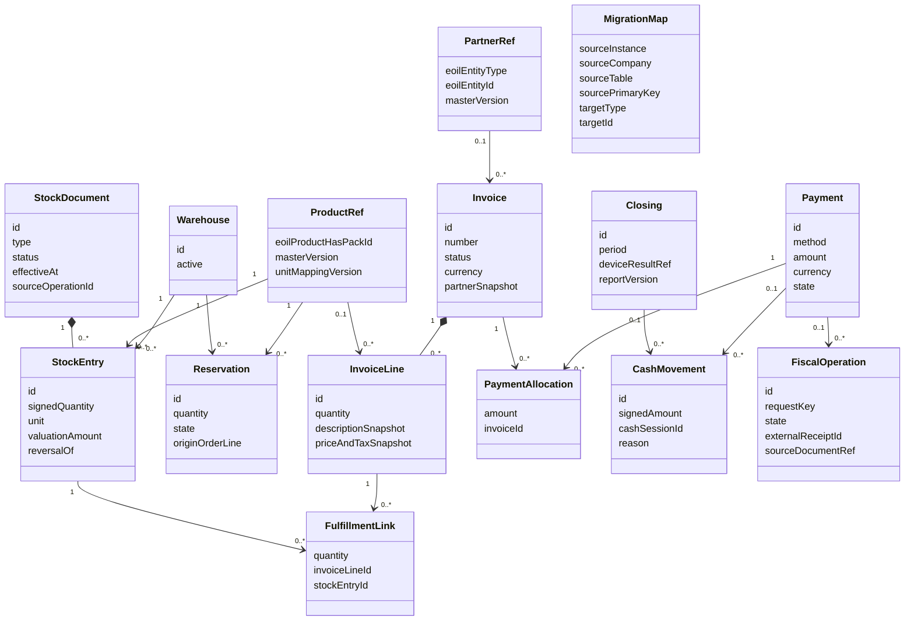
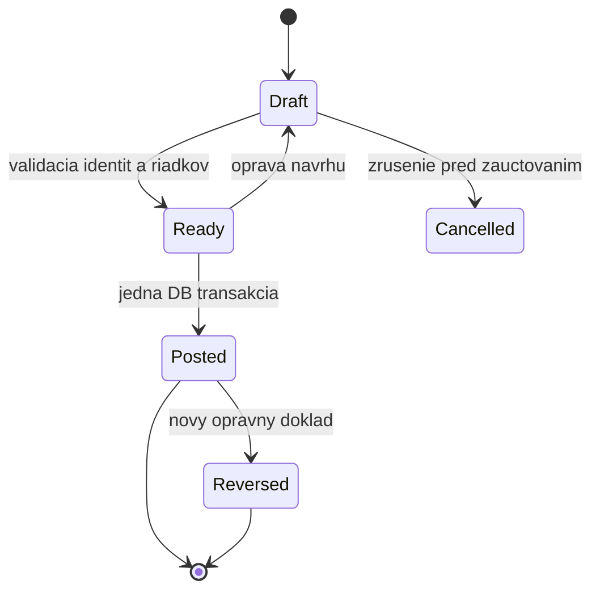

# Navrhovaný doménový model ERP

Konceptuálny model, nie SQL DDL. ID eOil sa v ERP používa ako externá referencia, nie ako FK naprieč databázami. Názvy tried sú návrh a nemusia sa zhodovať s názvami fyzických tabuliek MRP.

Diagram zachytáva hlavné evidenčné jadro; ponuky, nákupné objednávky, POS predaj a inventúry majú vlastné hlavičky a riadky, ktoré používajú rovnaké ProductRef/PartnerRef a odkazujú na vzniknuté doklady. Podrobný model týchto agregátov vznikne po UI walkthrough. `sourceDocumentRef` musí mať validovaný typ a ID; nemá byť ľubovoľný textový odkaz.

## Invarianty návrhu

1. Zaúčtovaný StockEntry je nemenný. Oprava vytvorí reverzný alebo rozdielový zápis s dôvodom a autorom. Rozpracovaný dokument možno editovať do zaúčtovania.
2. Rovnaká obchodná operácia nesmie vytvoriť dva účinky na zásobu. Unikátna identita operácie a DB transakcia chránia pred opakovaným volaním.
3. Množstvá a peniaze sú presné desatinné hodnoty. Presnosť, zaokrúhlenie a jednotky sa stanovia z MRP pravidiel; nepoužívať float ani sumu rôznych jednotiek ako skladový kontrolný súčet.
4. Stav zásoby je súčet otváracieho zápisu a následného denníka. Materiálizovaný zostatok je kontrolovateľná projekcia. Rezervácia nemení fyzický stav.
5. Preskladnenie vytvorí vzájomne prepojené strany. Pri jednej ERP DB sa obe strany zaúčtujú atomicky; dvojfázové fyzické odoslanie/príjem by bol osobitný potvrdený workflow.
6. Faktúra nemá povinný skladový účinok. Textové/službové riadky a úhrada existujúcej faktúry nesmú vytvoriť skladový pohyb.
7. Platba môže mať viac alokácií a doklad viac platieb. Výsledok terminálu a fiškálny výsledok nie sú synonymá „zaplatené“.
8. CashMovement zahrnie aj vklad/výber alebo opravu, ak sa potvrdia v rozsahu. Uzávierka musí rozlišovať hotovosť, kartu a ďalšie spôsoby úhrady; kartová úhrada nezvyšuje fyzickú hotovosť.
9. História dokladu nesmie závisieť od aktuálneho názvu, ceny, DPH či adresy v eOil. Uloží sa snímka použitých údajov a ich pôvod.
10. Migrovaný historický doklad má provenienciu a pôvodný stav; jeho import nespúšťa email, platbu, výdaj ani fiškalizáciu.

## Navrhovaný životný cyklus skladového dokladu

`Reversed` označuje existenciu opravy, nie zmazanie pôvodných zápisov. Stavový automat ERP je návrh; nie preklad všetkých kódov JEPLATNY či STORNO. Tie zostávajú uložené ako zdrojové metadáta.
