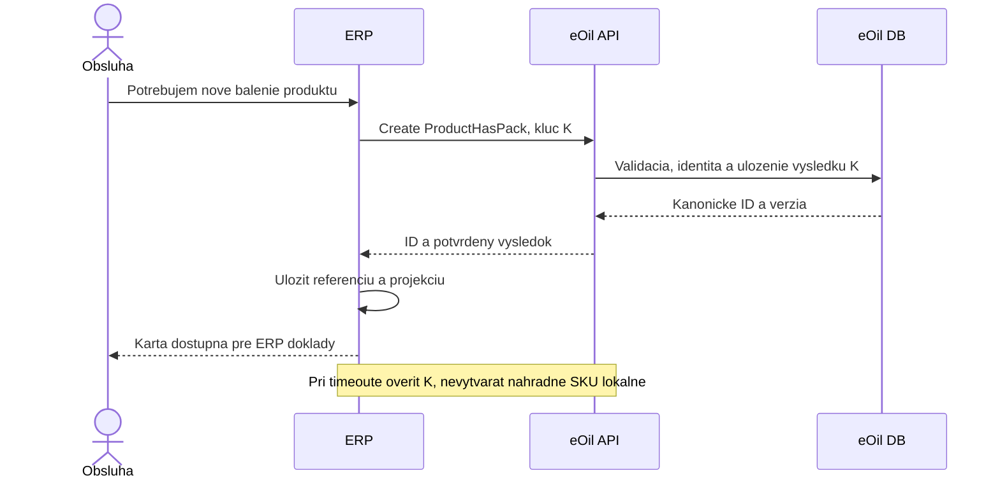
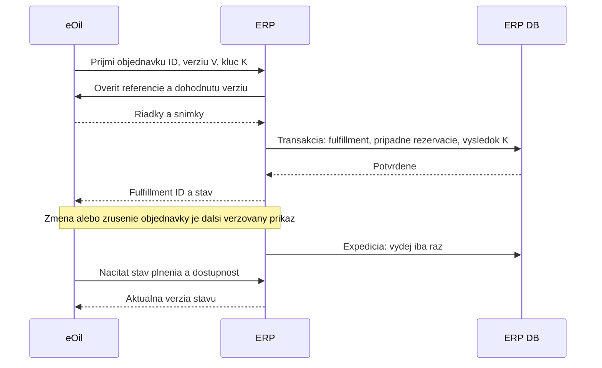
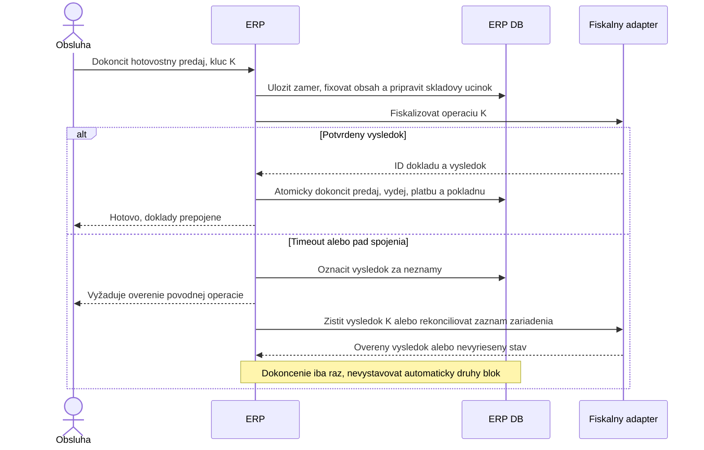
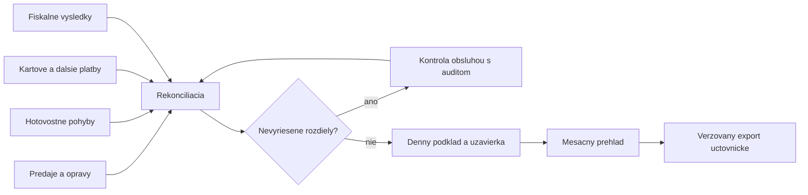

# API, sekvencie a zlyhania

Kontrakty sú konceptuálne. Cesty nižšie neexistujú a zatiaľ sa neimplementujú. API prenáša `ProductHasPack.id` ako autoritatívny identifikátor SKU; MRP číslo ostáva migračná/external referencia.

## Minimálna integračná plocha

| Vlastník | Koncept endpointu | Zodpovednosť |
|---|---|---|
| eOil | `GET /erp-api/v1/product-packs/{id}` | Identita, verzia, stav, jednotka a schválené atribúty |
| eOil | `POST /erp-api/v1/product-packs:resolve-batch` | Hromadné overenie známych ID; nejednoznačné mapovania sú chyba |
| eOil | `POST /erp-api/v1/product-packs` | Prípadná tvorba cez existujúce eOil pravidlá; len ak sa potvrdí UI zakladania z ERP |
| eOil | `GET /erp-api/v1/partners/{type}/{id}` | Minimálna projekcia zákazníka/dodávateľa, nie heslá alebo celý User |
| eOil | `GET /erp-api/v1/orders/{id}` | Verzovaná objednávka a stabilné ID riadkov z existujúcej evidencie |
| ERP | `POST /api/v1/stock-documents/{id}/post` | Jednorazové zaúčtovanie pripraveného skladu, kontrola concurrency |
| ERP | `GET /api/v1/availability` | Fyzický stav, rezervácia, disponibilné množstvo a čas/verzia |
| ERP | `POST /api/v1/order-fulfillments` | Prevzatie konkrétnej verzie eOil objednávky; jednoznačné riadky |
| ERP | `GET /api/v1/operations/{key}` | Výsledok alebo stav neistej operácie bez opakovania účinku |

Pre mutácie je povinný idempotency key, hash významového obsahu a scope volajúceho. Rovnaký kľúč a obsah vracia pôvodný výsledok; iný obsah s rovnakým kľúčom je konflikt. Zápis výsledku operácie a lokálny obchodný účinok musia byť v jednej transakcii. Po timeout klient najprv zisťuje výsledok. Idempotencia v ERP sama nedokazuje idempotenciu zariadenia.

## Založenie SKU

Jednoduchšia prvá verzia môže presmerovať obsluhu do existujúcej správy produktov eOil a následne načítať ID. Endpoint tvorby nie je podmienkou prvého ERP. Rozhodnutie závisí od toho, kto a kde má schvaľovať nové SKU.

## E-shop objednávka a sklad

Čiastočné plnenie, zmena ceny a storno po expedícii musia mať explicitné pravidlá. Samostatné `status` v eOil a ERP nesmú obidva reprezentovať tú istú autoritu. Odporúčanie: eOil vlastní zákaznícku požiadavku, ERP vlastní realizované skladové a finančné účinky. Mapovanie stavov do e-shopu je projekcia.

## Hotovostný predaj, fiškálny modul a neistý výsledok

Ide o navrhovanú orchestráciu, nie potvrdené možnosti Elcom. Ak zariadenie nepodporuje lookup podľa K, treba adapterový register a overený postup rekonciliácie podľa jeho protokolu. Pri fiškálnom úspechu a páde ERP sa lokálna operácia dokončí z trvalo uloženého zámeru a overeného výsledku. Prijatá hotovosť v nedokončenej operácii sa nesmie stratiť z evidencie rozpracovaných platieb. Skladová rezervácia/pripravený účinok musí zabrániť konkurujúcemu predaju počas dokončovania.

Kartová platba pridáva samostatný stavový automat terminálu. Postup pri schválenej platbe a zlyhanej fiškalizácii vrátane prípadného refundu sa musí overiť na presnom zariadení. Nemožno ho nahradiť univerzálnym automatickým retry.

## Uzávierky

Presný rozdiel medzi uzávierkou zariadenia, aplikačným denným reportom a mesačným podkladom ešte treba potvrdiť na existujúcich výstupoch. Už odovzdaný výstup má identitu, obdobie a verziu; oprava nesmie ticho prepísať odovzdanú históriu.

## Messaging a fronty: kedy majú dôvod

| Potreba | Prvá možnosť | Dôvod na rozšírenie |
|---|---|---|
| Používateľ čaká na vytvorenie SKU/dokladu | Synchrónne API s idempotenciou | Queue problém identity nevyrieši |
| Aktualizácia katalógovej cache | Periodické čítanie s kurzorom, vrátane deaktivácií | Event feed až pri požiadavke na nižšiu latenciu/objeme; overiť podporu eOil |
| Prenos fulfillment stavu | Opakovateľné čítanie alebo jednoduchý integračný worker | Outbox ak treba garantované asynchrónne doručenie zmeny po DB commite |
| PDF, export, migrácia | CLI/naplánovaný job s evidenciou behu | DB queue ak užívateľské requesty trvajú dlho alebo treba paralelizáciu/retry |
| Fiškalizácia | Trvalý operation journal a explicitný protokol | Fronta môže serializovať zariadenie, ale nevyrieši neznámy výsledok |
| Email | Background job po potvrdení dokladu | Trvalá queue, keď je odoslanie v rozsahu a potrebujeme retry/status |

Východisko neobsahuje RabbitMQ/Kafka/Redis ako povinnú súčasť. Trvalá evidencia operácie a jednoduchý obnovovací worker majú dôvod už pri zariadeniach; nejde automaticky o distribuovaný event systém. Webhooky sa pridajú až s definovaným retry, podpisom a rekonciliáciou.
