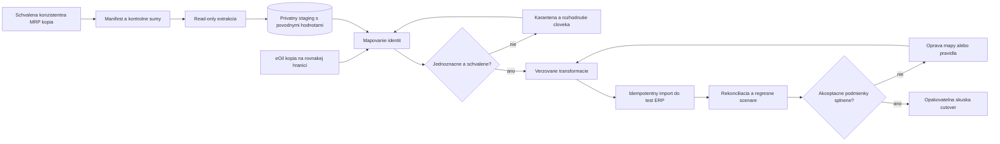

# Automatizovaná migrácia MRP → eOil ERP

**Návrh, importér zatiaľ neexistuje.** Výskumné nástroje dnes iba čítajú. Cieľom je opakovateľný a kontrolovateľný proces, nie jednorazový SQL prepis tabuliek.

## Architektúra migrácie

Staging uchová pôvodné hodnoty, encoding, zdrojový PK a hash riadka; transformované hodnoty sú osobitné. Obsahuje osobné údaje a doklady, preto je súkromný, prístupovo obmedzený a mimo Gitu. Migračné dôkazy v repozitári sú agregované.

## Identita a opakovanie

SourceKey = stabilná identita zdrojovej inštancie + firmy/datasetu + tabuľky + úplný primárny kľúč. Identita extrakčného behu je samostatná; **nová záloha tej istej firmy nesmie vytvoriť nový namespace všetkých identít**. DATA0001 a DATA0003 zatiaľ považujeme za samostatné datasety s možným prekryvom; ich spoločnú obchodnú identitu treba preukázať.

Migračná mapa uchová SourceKey, cieľové ID, hash zdrojového obsahu, verziu transformácie, stav, dôvod manuálnej výnimky a posledný run. Importér používa jedinečný SourceKey a transakčný checkpoint po dávke. Opakovanie rovnakého obsahu je no-op; zmena obsahu vyvolá riadenú aktualizáciu alebo konflikt podľa životného cyklu dokladu. Už vystavený nový ERP doklad sa nesmie prepísať replayom histórie.

## Predbežné mapovanie

| MRP zdroj | Cieľ / spôsob | Dôležitá podmienka |
|---|---|---|
| SKKAR | Mapa na existujúci eOil ProductHasPack, ERP ProductRef | Typ 14 overiť oboma smermi; presná desatinná identita; bez automatického EAN merge |
| SKLADY | Warehouse | Potvrdiť používané, archívne a sklady so zostatkom bez pohybov |
| SKKARSTA | Overený otvárací stav a cenové podklady | 141 záporných riadkov zachovať alebo zdokumentovane vysporiadať; nevymazať |
| SKPOH / SKPOHPOL / SKPOHREF | Historické StockDocument/Entry alebo archív + mapy | O/T, JEUCETPOL, smer, opravné a transferové referencie |
| SKKARINV / SKKARINVP | Inventúra a archív spočítaných hodnôt | Historická inventúra nesmie znova upraviť sklad |
| ADRES a pridružené tabuľky | Mapy do existujúcich eOil partnerov; snímky dokladov | Rozlíšiť právnickú osobu, kontakt a login; neprodukovať prihlasovacie účty pre každého partnera |
| OBJPR / OBJPRPOL | Ponuka alebo zákaznícky pracovný doklad | Neodvodzovať význam iba z názvu; potvrdiť NABIDKA a rozpracovanosť |
| OBJVY / OBJVYPOL | Nákupná objednávka | Odlíšiť vybavené, otvorené a čiastočné množstvá |
| FAKVY / FAKPR a riadky | Historická faktúra, otvorený doklad alebo archív | Snímky cien/daní/partnerov, pôvodná čísla; bez nového skladu |
| FAKVYUHR / FAKPRUHR | Platby a alokácie | Reprodukovateľný zostatok, rozdiel domácich/cudzích mien |
| MOARCHIV / MOPLATBY | POS predaj a platby | Zachovať väzbu na už importovaný sklad; oddeliť metódy platieb |
| EKASA_LOG | Archív fiškálnych výsledkov a stavov | Nikdy znovu neposlať historické doklady do zariadenia |
| PENDE / POKL / MOUZAVERKY | Pokladničné/uzávierkové podklady a archív | Presné sumové mostíky potvrdiť na denných a mesačných výstupoch |
| OSPOH / ZAPOCTY | Pohľadávky/zápočty alebo archív | Rozsah otvorených položiek potvrdiť s účtovníčkou |
| DOCSTORE / DOCSTORED | Úložisko príloh a väzby | Bity a hash súboru, metadata a oprávnenia; žiadne verejné URL |
| EMAILLST, FIRLOG, DOCEVENT | Dohľadateľná auditná história podľa retenčného rozhodnutia | Import nevytvára nové emaily; pôvodný autor nie automaticky ERP účet |
| DATASPOL, DATALOCK, práva | Selektívny manuálne schválený prevod nastavení | Nepreberať heslá, runtime zámky ani nepochopené práva |

Chýbajúci eOil produkt sa buď schválene vytvorí cez eOil API, alebo sa položka ponechá ako historická nepriradená referencia bez nového operatívneho skladu. Rozhodnutie závisí od aktívnosti a zostatku. **Otvorené skladové položky bez jednoznačného ProductHasPack sú blokátorom cutover.** Prípad viacerých MRP kariet pre jeden ProductHasPack vyžaduje kontrolu jednotiek, zostatkov a historických duplicitných účinkov, nie zákaz všetkých many-to-one máp bez analýzy.

## Dve stratégie histórie

| Stratégia | Výhoda | Riziko / podmienka |
|---|---|---|
| A: Aktuálny stav ku cutover + nemenný archív dokladov + otvorené položky | Menší rozsah rekonštrukcie starej logiky, rýchlejšia kontrola | Históriu treba vyhľadávať/reportovať oddelene; nepreráta historické ceny novým algoritmom |
| B: Kompletný replay historických pohybov a pravidiel | Jednotný historický ledger | Musí reprodukovať prevody rokov, ceny, opravy a prekrývajúce sa databázy; vyššie riziko |

Predbežné odporúčanie je **A**, ak firma prijme historický archív s preklikom a reportami. Otvorené faktúry/objednávky sa prenesú operatívne s ich zostávajúcim účinkom. Nie je to rozhodnutie históriu zahodiť. Stratégia sa schváli až po určení požiadaviek na spätné reporty a audit.

Pri A sa do denníka vloží jeden zdokumentovaný otvárací stav pre každú relevantnú kombináciu SKU/sklad ku konkrétnemu cutover času. Všetky staršie pohyby sú historické bez nového účinku. Pri B je potrebné definovať hranicu pôvodných opening hodnôt a zahrnúť iba príslušné T pohyby; nesmie sa sčítať opening a všetky O pohyby. Overený vzorec v aktuálnej kópii je kontrolná referencia, nie univerzálny import bez časovej hranice.

## Povinné rekonciliácie

1. Zdrojový manifest, konzistentnosť zálohy a počet riadkov po tabuľkách; odchýlka má pomenovaný dôvod.
2. Pokrytie identít: aktívne a nenulové karty 100 % schválená mapa; ostatná história môže mať explicitné archivované výnimky. Žiadne tiché vyradenie.
3. Množstvo po SKU/sklade/jednotke; začiatok + pohyby = koniec. Baseline 75 831 riadkov sedí, no pri cutover sa meria znova.
4. Ocenenie po potvrdenom algoritme a presnosti; nulové skladové CENAMJ nie je automatická importná cena.
5. Faktúry: základ, daň, zaokrúhlenie, celok, úhrady a otvorený zostatok po mene/období/type dokladu. Nevyrovnávať rozdiely umelou položkou.
6. Pokladňa: hotovosť, karty, ďalšie platby, refundy, fiškálne doklady, výdajky a denné/mesačné výstupy. Každý rozdiel musí mať vysvetlenie a schválenie.
7. Väzby a prílohy: počet osirelých odkazov, typované referencie, hash súboru. Označiť aj pôvodne chýbajúce väzby.
8. Dvojité spustenie, prerušenie behu, opätovný export a pokračovanie; rovnaké počty a súčty bez duplicitných účinkov.

Tolerancie sú explicitné po poli a mene podľa potvrdenej aritmetiky MRP. Predvolená akceptácia rozdielu nie je percento „dosť dobré“. V aktuálnom množstvovom kontrolnom dotaze bola hranica 0,00001 a maximum rozdielu 0,000000.

## Cutover a návrat

1. Rehearsal na izolovaných kópiách, zdokumentovaný čas a zodpovední ľudia. Otestovaná obnova cieľa a príloh.
2. Schválený zoznam systémov/zariadení, ktoré zapisujú sklad alebo hotovosť. Ukončenie otvorených predajných relácií a vysporiadanie neznámych fiškálnych/platobných výsledkov.
3. Stop zápisov do MRP na odsúhlasenej hranici, konzistentný finálny export a záloha. eOil môže prijímať objednávky iba podľa explicitného plánu ich odloženia/prebratia.
4. Finálny import alebo riadené delta. UPD_DATE samotné sa nepovažuje za dôkaz kompletných zmien; mazania a postranné účinky treba zachytiť. Pre tento rozsah môže byť bezpečnejší úplný opakovaný export s porovnaním hashov.
5. Kontroly, schválenie zostatkov/dokladov/uzávierok, prepnutie autority skladu a zariadení. MRP zostane archív na čítanie; zakladanie/pohyby nesmú pokračovať v oboch systémoch.
6. Pred prvým reálnym novým predajom možno návrat riešiť riadeným obnovením pôvodnej autority. **Po nových platbách alebo fiškálnych dokladoch jednoduchý DB restore nestačí.** Potrebný je forward recovery alebo vyrovnanie všetkých vzniknutých operácií a zariadení podľa potvrdeného postupu.

Migračné procesy sa budú spúšťať ako CLI úlohy s run manifestom, checkpointmi, metrikami a karanténou. Samostatný message broker nie je potrebný len kvôli migrácii.
