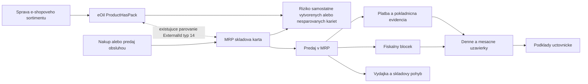

# Aktuálny stav: funkcie, ktoré náhrada musí posúdiť

Čísla sú z DATA0003, pokiaľ nie je uvedené inak. Odkazy E1–E7 sú definované v [metóde](01-scope-and-method.md). **Potvrdené používateľom 27. 9.:** peňažný denník je prepojený s pokladňou/fiškálnym modulom; prijatá hotovosť má bloček; výdaj tovaru má skladovú výdajku, blok aj pokladničný pohyb. Denne a mesačne sa robia uzávierky pre účtovníčku. Ide o opis dnešného procesu, nie samostatný právny výklad.

## Dnešné pracovné hranice

Diagram vychádza z opisu používateľa a z potvrdených dátových väzieb. Neurčuje technické poradie commitov v MRP; tie ešte treba pozorovať.

Časť položiek vzniká iba v MRP pri nákupe/predaji, časť iba v eOil kvôli e-shopu. Toto je používateľom popísaný mechanizmus rozchádzania evidencie. SQL profil zatiaľ neurčuje počet takých prípadov ani konkrétneho pôvodcu. Cieľom nového vlastníctva dát je mať jedno miesto tvorby identity a viac miest, ktoré ju používajú.

## Rozsah funkcií

| Oblasť | Pozorovanie | Dôkaz | Dopad na nové riešenie / stav |
|---|---|---|---|
| Karty a balenia | 10 638 kariet; 16 čísel má desatinnú časť | E2 `card_identity` | Mapovať na eOil ProductHasPack; zachovať pôvodný identifikátor |
| Čiarové kódy | 134 duplicitných neprázdnych kódov na 336 kartách | E2 `ean_duplicates` | Kód nie je automatický migračný kľúč; príčinu duplicít treba preveriť |
| Jednotky a vlastnosti | Rôzne zápisy jednotiek, 402 prázdnych MJ; 3 karty s vlastnými poliami | E2 `dist_SKKAR_MJ`, E3 `card_extra_usage` | Explicitný slovník jednotiek; prázdna MJ sa nesmie automaticky zmeniť na ks |
| Sklady a zostatky | 10 skladov, 75 831 stavových riadkov, 2 282 nenulových, 141 záporných | E2 `warehouses`, `stock_balance` | Politika záporného stavu a aktívne sklady vyžadujú potvrdenie |
| Príjem a výdaj | 75 155 hlavičiek, 124 059 položiek; reálne pohyby v skladoch 1 a 10 | E1; E2 `movement_types` | Samostatné doklady a nemenný denník zaúčtovaných pohybov |
| Presuny a spotreba | Príjem/výdaj preskladnenia, vnútorná spotreba, reklamné predmety | E2 `movement_types` | Nestačí model nákup/predaj; presun spája dva skladové účinky |
| Opravné pohyby | Opravné príjmy aj výdaje, stornovacie príznaky a referencie | E2 `movement_types`, E3 `stock_refs` | Väzby opráv na pôvodné doklady; význam typov treba potvrdiť |
| Inventúra | 22 hlavičiek, 100 404 riadkov; posledný dátum 31. 12. 2025 | E1, dátumové rozsahy | Počítanie, rozdiel, schválenie a opravný pohyb; historické inventúry |
| Ročný prevod | 56 334 pohybov `O`, 18 821 `T`; prečítaná prevodová procedúra | E3 `validity_year`, E5 | Počiatočné stavy a história sa nesmú započítať dvakrát |
| Rezervácie | 1 hlavička OBJPR s rezerváciou, 2 položky s rezervovaným množstvom | E2 `order_links_state` | Mechanizmus existuje; jeho budúce používanie pri e-shope je samostatné rozhodnutie |
| Ponuky / prijaté objednávky | 1 984 hlavičiek OBJPR; 1 962 s `NABIDKA=T`, 22 s `F` | E2/E3 `quotes_year` | Nepovažovať celú tabuľku za objednávky. Ponukový workflow je relevantný |
| Vydané objednávky | 5 559 hlavičiek, 26 738 riadkov; 558 hlavičiek v 2026 | E1/E2 `years_OBJVY` | Nákupné objednávky, príjem a čiastočné plnenie preveriť v UI |
| Vydané faktúry | 4 108 hlavičiek, 11 346 položiek, 4 077 riadkov úhrad | E1 | Fakturácia, tlač, číslovanie, úhrady, opravy |
| Prijaté faktúry | 2 750 hlavičiek, 12 227 položiek, 2 691 riadkov úhrad | E1 | Nákupný doklad je odlišný od príjmu tovaru |
| Opravné a zálohové väzby | 25 neprázdnych DOBROPIS_PRO, 46 CIS_PREDF na vydaných faktúrach | E3 `corrections_nonblank` | Overiť dobropisy, zálohy, zaokrúhlenie a korekcie dane |
| Maloobchodný predaj | 62 101 archívnych predajov, 61 986 riadkov platieb, 62 092 skladových väzieb | E1/E2 `links_MOARCHIV` | Predaj, viac spôsobov úhrady, výdaj, vratka a fiškalizácia |
| Fiškálne operácie | 31 359 logov; väzby na POS, sklad aj faktúry | E2 `links_EKASA_LOG` | Fiškalizácia nie je iba tlač POS bločku; 177 logov typu UF treba zahrnúť do overenia úhrady faktúry |
| Uzávierky | 3 622 MOUZAVERKY, posledný záznam 25. 9. 2026 | E1, dátumy; používateľ | Denné a mesačné uzávierky a podklady účtovníčke patria do rozsahu; konkrétny formát otvorený |
| Peňažný denník | 3 817 riadkov; väzby 3 803 na úhrady FV a 14 FP | E3 `cashbook_links`; používateľ | Nenahradiť iba sklad a faktúry; zachovať prepojenie hotovosť–doklad–účtovný podklad |
| Pokladničné doklady | 19 POKL, z toho 6 v 2026 | E1/E2 `years_POKL` | Preveriť vklady, výbery a ďalšie pohyby; POKL nie je celý POS predaj |
| Ostatné pohľadávky | 8 632 OSPOH, z toho 88 v 2026 | E1/E2 | Aktuálna dátová stopa; význam a prípadná automatická tvorba zatiaľ otvorené |
| Zápočty | 44 hlavičiek / 101 riadkov, posledné dáta 2025 | E1/E2 | Potvrdiť prenos otvorených zápočtov a historický archív |
| Adresár | 6 782 partnerov; 140 bankových záznamov, kontaktné údaje | E1 | Mapovať do eOil; používateľský účet a právnická osoba nemusia byť totožné |
| Prílohy a komunikácia | 1 890 príloh, približne 95,4 MiB; 1 813 emailových záznamov | E2 `attachment_bytes`, E3 `attachments_links` | Preniesť súbory, metadáta a väzby; log nepreukazuje doručenie emailu |
| Práva a audit | 1 928 USRSRIGHTS, 12 FIRPRPR; FIRLOG a DOCEVENT obsahujú dáta | E1/E3 | Zmapovať role, dôvody opráv a audit; nie slepo kopírovať číselné práva |
| Bankové importy | BANOBRAT v D3 prázdna, v D1 561 riadkov | E1 | Historická funkcia; dnešnú potrebu potvrdiť, nevyhlásiť automaticky za zbytočnú |
| Účtovný denník, majetok | UCDE a MAJET prázdne v troch firmách | E1 | Neplánovať plné účtovníctvo len podľa schémy; odovzdávanie podkladov je potvrdené |
| Jazdy, kusové dáta | Historické jazdy; 4 SKKARKUS s aktuálnou dátovou stopou | E1 | Jazdy už rieši eOil; význam kusovej evidencie overiť pred vylúčením |

## Zistenia, ktoré menia návrh

**Sklad sa dá nezávisle prepočítať.** E3 `balance_hypothesis` porovnal všetkých 75 831 stavov s počiatočným množstvom plus podpísanými položkami, kde `SKPOH.JEPLATNY='T'` a `SKPOHPOL.JEUCETPOL='T'`. Nula rozdielov nad 0,00001, maximálny rozdiel 0,000000. Toto platí pre množstvá v dodanej kópii. Ocenenie, rezervácie a fyzický stav tým overené nie sú.

**Doklady nemajú jednoduchý vzťah 1:1.** 218 vydaných faktúr má viac než jeden pripojený skladový pohyb. Riadky faktúr často odkazujú na skladové riadky. Import faktúry nesmie automaticky znova vydať už vydaný tovar. Naopak priame objednávkové FK na skladových riadkoch sú v skúmanej kópii prázdne; zo samotnej schémy sa nedá bezpečne rekonštruovať plnenie všetkých objednávok.

**Označenie firmy rokom neoddeľuje históriu.** D3 má aj dáta pred rokom 2025. D1 obsahuje 25 167 vydaných faktúr a 123 425 pohybov. Zlúčenie databáz podľa samotného ID alebo čísla dokladu by mohlo vytvoriť duplicity. Identitu zdroja treba uchovať a prekryv dokázať.

**Príznaky nemusia znamenať to, čo naznačuje názov.** V adresári sú ODBERATEL aj DODAVATEL všade `F`, hoci partneri sú použité na dokladoch. `KUSY` má číselné hodnoty 1, 2, 3; z toho nemožno vyhlásiť všetky karty za sledované sériovým číslom. Roly partnerov a význam kódov treba odvodiť z potvrdeného workflow.

**Ocenenie je samostatná analýza.** Všetkých 2 282 nenulových stavov má v SKKARSTA CENAMJ nulu. Procedúra však podporuje spoločnú cenu na SKKAR aj oddelenú cenu na sklad podľa nastavenia. Vybrané FIRMNAST obsahuje S_FIFO="0" a S_DOMINUSU="1"; rozhodujúce S_SEPARE sa týmto dotazom nenašlo. Nulová cena na sklade preto nie je dôkaz nulovej hodnoty zásob. Efektívne nastavenie, prepočty cien a dodatočné náklady ostávajú otvorené.

**Chýbajúce alebo duplicitné produkty medzi systémami ešte nie sú kvantifikované.** Poznáme duplicity kódov v MRP; neprofilovali sme súbežnú eOil databázu. Párovanie `ExternalId(type=14)` sa musí zmerať oboma smermi na rovnakej časovej hranici. Žiadny záver o chybe konkrétneho človeka z týchto agregátov nevyplýva.
