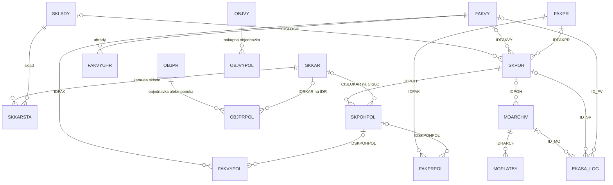

# Dátový model existujúceho MRP

Výber z deklarovaných väzieb DATA0003; kompletný strojový register je v [FK CSV](evidence/DATA0003-foreign_keys.csv). Diagram zobrazuje možnosti modelu, nie tvrdenie, že každá väzba je vyplnená. `o|` na strane rodiča označuje voliteľný odkaz dieťaťa.

Diagram zámerne nezlučuje POS, pokladničný pohyb, úhradu a fiškálny log do jednej entity. Predaj je jeden obchodný prípad s viacerými súvisiacimi záznamami. Pri migrácii treba udržať ich väzby a odlišné identity.

## Identifikátory a význam polí

| Zdroj | Overený fakt | Pravidlo pre mapovanie |
|---|---|---|
| SKKAR.IDR | Technický identifikátor karty | Uchovať spolu s identitou zdrojovej databázy |
| SKKAR.CISLO | NUMERIC(10,2), 16 necelých čísel | Prenášať bez float konverzie; nerozrezať `.01`; kanonizácia musí byť explicitná |
| SKKAR.KOD | Nie je unikátny medzi kartami | Pomocný kandidát pre párovanie, nie unikátny automatický kľúč |
| SKKARSTA | Karta/sklad, počiatočný a aktuálny stav, rezervácie | Množstvo a ocenenie analyzovať oddelene |
| SKPOH.JEPLATNY | T a O v dátach; prevodová logika T → O | O = stav po ročnom prevode podľa prečítanej logiky; nie vymazaný doklad |
| SKPOHPOL.JEUCETPOL | Filter T potrebný pre overený prepočet | Nezapočítať všetky riadky bez skúmania účinku |
| ADRES.IDRADR / ICO | Surrogate ID a CHAR(12) používaný vo väzbách | ICO nevyhlásiť bez kontroly za platné štátne IČO alebo globálnu identitu osoby |
| OBJPR.NABIDKA | Väčšina hlavičiek T; trigger aktualizuje podľa riadkov | Overiť aj zmiešané riadky; nedeliť dokumenty iba podľa názvu tabuľky |
| VYBAVENE, DRUH, STATE | Viaceré číselné/textové hodnoty | Význam doplniť z UI/logiky; kód 2 či 200 automaticky neznamená úspech |
| LOG_DATE / UPD_DATE / UPDCNT | Existujú v časti tabuliek | Nie sú zatiaľ preukázaným kompletným change feedom vrátane mazaní |

## Overené z existujúceho eOil kódu

Na revízii uvedenej v manifeste:

- `eoil-yii2/common/models/ProductHasPack.php` prepája Product a Pack; metóda `saveExternalId()` pre typ MRP používa `MrpPairingService`. `ExternalIdType::MRP = 14` je existujúci integračný bod.
- `Pack.php` drží `amount` a `large` ako textové údaje; prepočet predajného balenia na skladovú jednotku sa nesmie odhadnúť zo zobrazovaného názvu.
- `User.php` obsahuje účet aj zákaznícke/fakturačné údaje. `Supplier.php` je ďalší existujúci model. Vlastníctvo obchodného partnera musí rešpektovať tieto existujúce entity.
- `Order.php` má používateľa, snímky fakturačných/dodacích údajov, stav a platbu. `Cart.php` slúži aj ako riadok objednávky, cez `productHasPackId` a `orderId`. V návrhu preto nepredstierame existujúcu samostatnú tabuľku OrderItem.
- `MotorsistemApiController.php` je špecifické existujúce API; nie všeobecné ERP API ani jednotné prihlásenie. Nové kontrakty a oprávnenia treba navrhnúť explicitne.

Produkčné unikátne indexy, úplnosť ExternalId a počty konfliktov ešte overené nie sú. Aplikačná kontrola párovania sama osebe nie je dôkaz databázovej jedinečnosti.
