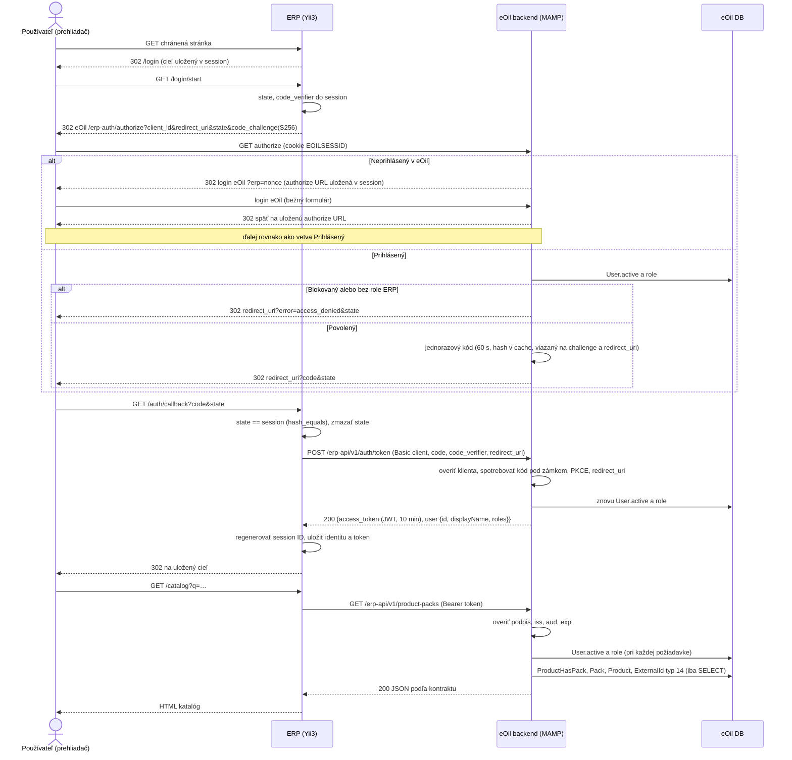

# M2 — prihlásenie cez eOil a čítanie katalógu cez API

Stav: **implementované a overené lokálne, 27. 9. 2026 (M2 + M2.1)**, podklad pre lokálnu implementáciu a nezávislé review. Zadanie: `docs/development/claude-m2-handoff.md` (koordinátor). Produkčné nasadenie nie je súčasťou balíka.

## Čo je overené v kóde eOil (revízia `de5a5c2`, vetva `release/8`)

| Zistenie | Zdroj | Dôsledok |
|---|---|---|
| Prihlásenie je formulár na frontende, session `EOILSESSID`, identity cookie `_identity`, `WebUser` + `common\models\User` | `frontend/controllers/AuthController.php`, `backend/config/main.php` | ERP nemá vidieť heslo; využije existujúcu session eOil |
| Blokovaný používateľ = `User.active = 0`; `findIdentity` vracia iba `active = 1` | `common/models/User.php` | Každé overenie musí čítať aktuálny `active` |
| Role = `AuthAssignment.itemname` ∪ `user_roles.role`; newadmin pustí Admin/Seller/Product | `User::getRoles()`, `newadmin/Module.php` | ERP potrebuje vlastný explicitný zoznam rolí |
| Existuje krátkodobý HS256 JWT (firebase/php-jwt 7.0.2) pre AI agenta, secret z env/runtime súboru, allowlist rolí v params | `backend/components/AgentJwt.php`, `backend/config/params.php` | Rovnaký mechanizmus a vzor konfigurácie, ale **iný secret a audience** — token agenta sa nepoužije |
| Login po úspechu ignoruje návratovú adresu (Admin → backend) | `AuthController::actionLogin` | M2: po prihlásení do eOil treba pokračovať ručne. **M2.1:** návrat cez jednorazový nonce v session (sekcia M2.1), bežný login bez zmeny |
| MRP väzba: `ExternalId(model='ProductHasPack', modelId, typeId=14, value)`, 1:1, zapisuje iba `MrpPairingService` | `ExternalIdType::MRP`, `MrpPairingService` | API iba číta; hodnotu normalizuje `MrpCislo::bare()` |
| `MrpCislo::bare`: odstráni `.00`, zachová `.01`, `.02` (náhradné karty) | `common/services/mrppairing/MrpCislo.php` | `110950.00` = `110950`, ale `110950.01` je iná karta |
| Názov a balenie: `ProductHasPack::getName()`, `Pack::getName()` | modely | API použije existujúcu logiku zobrazenia 1:1 |
| Cache je `FileCache`; existuje `eoil_test` (InnoDB, testy s rollbackom) | `common/config/main.php`, `_BaseDbTest` | Jednorazové kódy v cache so zámkom, bez zmeny schémy |
| Žiadne všeobecné SSO ani OAuth server v eOil | prehľadávanie kódu | Minimálny koncový bod podľa štandardu, nie nová kryptografia |

## Zvolený mechanizmus

**Podmnožina OAuth 2.0 Authorization Code s PKCE (RFC 6749, RFC 7636)** a dôverným klientom. eOil je autorizačný aj zdrojový server, ERP je klient. Prístupový token je **JWT HS256 (RFC 7519) cez existujúcu knižnicu** firebase/php-jwt; ERP ho považuje za nepriehľadný reťazec a drží ho iba na serveri v session.

Prečo nie jednoduchšie: prihlasovanie menom a heslom cez ERP by ERP vystavilo heslám; token v URL presmerovania by skončil v histórii a logoch. Prečo nie úplný OAuth server (napr. league/oauth2-server): potrebuje DB tabuľky a kľúče, čo je v M2 neprimerané a vyžadovalo by schémové zmeny. Nevzniká vlastný kryptografický protokol: používajú sa `random_bytes`, SHA-256 (PKCE S256), `hash_equals` a JWT knižnica.

Konfigurácia eOil (params, hodnoty z env alebo git-ignorovaných súborov v `backend/runtime/`, rovnako ako `mcpJwtSharedSecret`):

| Param | Predvolené | Význam |
|---|---|---|
| `erpClientId` | `eoil-erp` | identifikátor klienta |
| `erpRedirectUris` | `[]` | presný zoznam povolených callback URL; prázdny = tok vypnutý |
| `erpClientSecret` | nenastavený | tajomstvo klienta pre výmenu kódu (min. 32 znakov) |
| `erpJwtSecret` | nenastavený | podpisový kľúč prístupových tokenov, **odlišný** od MCP |
| `erpAllowedRoles` | `[]` | role s prístupom do ERP; prázdny = nikto. **Potvrdené pravidlo: iba `Admin`** (kód iné role ignoruje, pozri M2.1) |
| `erpAccessTokenTtl` | 600 s | životnosť prístupového tokenu |

## Sekvencia

## Hranice dôvery

- **Prehliadač** nedostane prístupový token ani client secret; prenáša iba jednorazový kód a `state`.
- **ERP server** drží client secret a tokeny používateľov v serverovej session; nečíta DB eOil.
- **eOil** drží podpisový kľúč a rozhoduje o identite, blokovaní a rolách pri každej požiadavke; API je iba na čítanie (GET) okrem výmeny kódu.
- `redirect_uri` musí presne zodpovedať zoznamu (žiadny open redirect). Návratová cesta v ERP je iba lokálna povolená cesta uložená v session.

## Stavy a chyby

| Situácia | Správanie |
|---|---|
| Neprihlásený v ERP | 302 na `/login`, cieľ sa zapamätá |
| Neprihlásený v eOil | M2.1: eOil presmeruje na svoj login s jednorazovým nonce; po prihlásení sa sám vráti na authorize a do ERP |
| Zablokovaný (`active=0`) alebo bez role | authorize → `access_denied`; token endpoint → 403; API → 403. ERP: „Prístup zamietnutý“, session sa zruší |
| Blokovanie/odobratie role počas session | najbližšia požiadavka na API → 403 → ERP zruší session |
| Vypršaný alebo neplatný token | API 401 → ERP zruší session; pri GET raz automaticky nový authorize/PKCE tok (najviac raz za 60 s), inak prihlasovacia stránka |
| Uplynutie ERP session | session končí najneskôr s tokenom (10 min); ďalšia GET ju obnoví automaticky cez eOil, nie po explicitnom odhlásení a nie pre POST |
| Odhlásenie | POST s CSRF, zrušenie ERP session; session v eOil ostáva (single logout mimo M2) |
| Zlý/opakovaný kód, iný verifier, iný redirect_uri | 400 `invalid_grant`; ERP „Prihlásenie sa nepodarilo“ |
| Nesúhlasí `state` | ERP 400, nič sa nevymení |
| Timeout, 5xx, neplatný JSON | ERP 503 „Katalóg sa nepodarilo načítať“ / „Prihlásenie je dočasne nedostupné“ |
| eOil bez konfigurácie | koncové body vrátia 503 `not_configured`, nič sa nevydá |

## Rozsah ERP

- `CATALOG_SOURCE=fixture`: ukážkový režim bez prihlásenia, iba dev/test, naďalej viditeľne označený.
- `CATALOG_SOURCE=http`: vyžaduje prihlásenie cez eOil; statický `CATALOG_API_TOKEN` z M1 sa nahrádza tokenom prihláseného používateľa.
- `APP_ENV=prod` zostáva odmietnutý: tok nie je overený na HTTPS nasadení ani nezávislým bezpečnostným review.
- HTTP bez TLS iba v dev/test na explicitne lokálnych hostoch (`localhost`, `127.0.0.1`, `host.docker.internal`).

## Katalógové API eOil

Kontrakt ostáva podľa [catalog-api-contract.md](../../development/catalog-api-contract.md). `name` = `ProductHasPack::getName(true)`, `packLabel` = `Pack::getName()`, `unit` = `Entity.name` alebo `null`, `active` = `ProductHasPack.active`, `mrpNumbers` = `MrpCislo::bare()` hodnôt typu 14 (bez prázdnych). Vyhľadávanie: podreťazec v spojení výrobca + produkt + viskozita (porovnanie podľa kolácie DB) alebo presná zhoda MRP po normalizácii. Poradie podľa `id`.

## M2.1 — dokončenie po review (návrh pred implementáciou, 27. 9. 2026)

Zadanie: `docs/development/m2-followup-handoff.md`. Rozsah zostáva lokálny, jeden server eOil; produkcia odmietnutá.

**Prístup iba `Admin`** (potvrdené používateľom 27. 9. 2026; nie Seller ani Product). `ErpConfig` prijme z `erpAllowedRoles` iba `Admin`, iné názvy ignoruje; prázdne = nikto. Neaktívny Admin (`active = 0`) prístup nemá. Role reálnych účtov sa nemenia.

**Automatický návrat z loginu eOil.** Existujúci login eOil návratovú adresu ignoruje (newadmin síce posiela `?return=`, formulár však posiela POST na `auth/login` bez query). Nezavádzame všeobecný `returnUrl` (riziko otvoreného presmerovania, zmena bežného loginu). Namiesto toho:
1. `erp-auth/authorize` pre neprihláseného overí klienta, redirect URI, state a PKCE, uloží **celú overenú authorize URL** do session eOil pod náhodným jednorazovým `nonce` (platnosť 5 min) a presmeruje na login eOil s `?erp=<nonce>`.
2. Login eOil pri `?erp=` iba zachová parameter vo formulári. Po úspešnom prihlásení, ak `erp` zodpovedá nonce v session a neuplynul čas, presmeruje na uloženú authorize URL (cieľ je uložený na serveri, z požiadavky sa neberie žiadna adresa). Bez parametra alebo pri nezhode sa login správa ako doteraz.
3. Authorize znovu kontroluje aktívnosť a rolu; zamietnutie ide ako `access_denied` na registrovaný callback ERP.

**Obnova ERP prihlásenia po expirácii tokenu.** Štandardný authorize/PKCE tok, žiadny obnovovací ani dlhší token:
- keď token ERP vyprší (alebo eOil vráti 401) a požiadavka je **GET/HEAD**, ERP raz automaticky spustí `/login/start` s bezpečnou pôvodnou GET adresou; pri platnej session eOil sa používateľ vráti bez formulára, inak prejde skutočným loginom eOil (a návratom podľa bodu vyššie);
- ochrana proti slučke: automatická obnova najviac raz za 60 s; ak sa nedokončí, ERP zobrazí prihlasovaciu stránku s vysvetlením;
- POST sa neprehráva (ne-GET požiadavka bez platného prihlásenia ide na `/login` bez automatiky);
- po **explicitnom odhlásení** sa automatická obnova nespustí (príznak obnoviteľnosti sa zruší);
- zablokovanie alebo odobratie roly: authorize vráti `access_denied` → ERP „Prístup zamietnutý“, bez ďalšieho pokusu.

**Security review** preveruje PKCE/state, presmerovania a návratové adresy, cookies a session fixation, expirácie a odobratie práv, jednorazové kódy a súbeh, chybové odpovede a únik tajomstiev do aplikačných, debug a access logov. Nálezy a regresné testy: [m2-validation.md](../../development/m2-validation.md).

## Mimo M2

Zápisy do eOil, tvorba SKU, single logout, obnovovacie tokeny, audit v ERP DB, HTTPS nasadenie, produkčné tajomstvá, viac serverov eOil (atomická spotreba kódov v zdieľanom úložisku).
